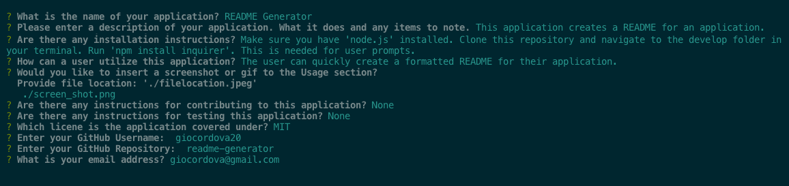

# README Generator

## Descripttion 
This application generates a README of the application for the user based on inputs the user provides to terminal prompts.

## Table of Contents
1. [Installation Instructions](#installation)
2. [Usage](#usage)
3. [Contributing to this Application](#contributing)
4. [How to test](#how-to-test)
5. [License](#license)
6. [Questions](#questions)

## Installation
Make sure you have 'node.js' installed. After cloning this repository, navigate to the develop folder and install inquire: 'npm install inquirer'.

## Usage
The user can use this application to quickly create a README file for their application.

Terminal View

Video Demo of the Application
[video Demo](undefined)

# License
This is the license being used for this applicaiton. Please look at the LICENSE.txt file in the repository for more information.
* MIT

## Contributing
None

## How to Test
None

# Questions
Have questions? Contact the developer at: 
* GitHub Username: giocordova20
* Email: giocordova@gmail.com
